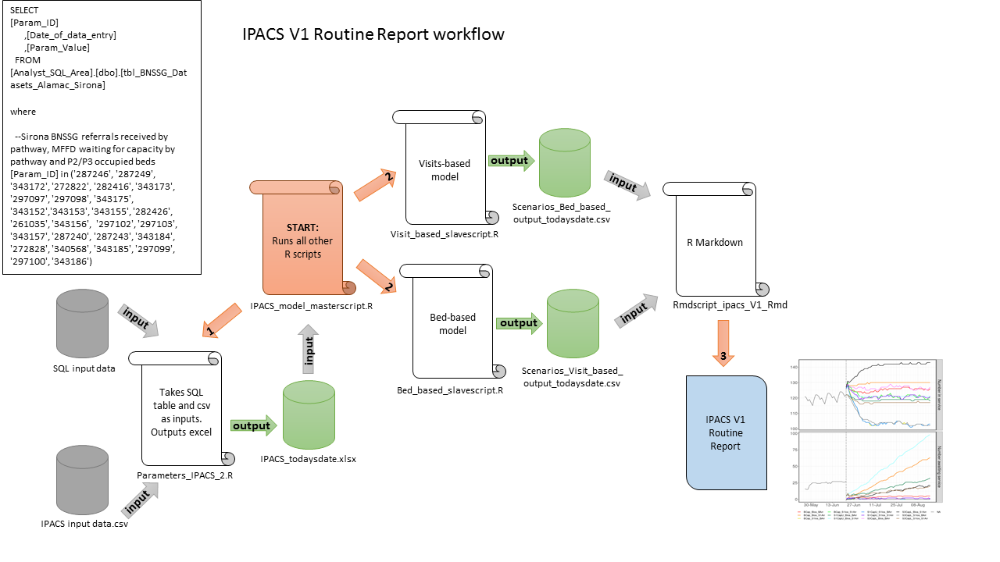

---
output:
  word_document
title: "BNSSG D2A: P1/P2/P3 Capacity Planning"
author: "Improving Patient Flow between Acute, Community and Social Care (IPACS). For more information, please contact Rich Wood (richard.wood16@nhs.net) or Paul Forte (paul.forte@nhs.net)"
date: '`r format(Sys.time(), "%d %B, %Y")`'
---

```{r setup-, include=FALSE}
knitr::opts_chunk$set(echo = FALSE)
library(knitr)
library(flextable)
```
  
### The IPACS model
* The IPACS model simulates flows of patients from acute discharge into the three D2A complex care pathways by locality.  
* This report outputs a range of pre-defined scenarios for a `r nrow(arr_rates)`-day (`r round(nrow(arr_rates)/30)` months) period.  
* Scenarios model the impact of varying acute referral patterns into D2A pathways, length of stay (LoS) in each pathway, and capacity in pathway.  
* For each day in the `r nrow(arr_rates)`-day period and for each pathway, the model estimates the mean number of patients in service, the mean number of acute patients delayed, and the mean number of days patients are delayed under given capacity constraints.  


### IPACS models the following processes at the locality level:  
    
  
### The workflow for creating this document is as follows:
  

### Model Scenarios

For each locality in BNSSG, and for each of P1, P2 and P3, modelled parameters and scenario combinations are displayed in the following two pages.  

The subsequent pages output 9 sets of plots, each displaying the `r (ncol(arr_rates)-1)/6` scenario combinations for each of:  

  * Number in service - the number of patients estimated to be utilising the service given service capacity;  
  
  * Number awaiting service - the number of patients estimated to be delayed in the acute sector awaiting D2A;  
  
  * Mean days delayed - the mean number of days delayed in the acute sector;
  
  * Costs - total system cost (acute delay cost + community service cost).

\newpage

### *Referrals:*  
Referral patterns are based on the mean numbers of referrals for the past month split by pathway and locality  

  * **BArr** *Baseline referrals*  
  <!-- *Pathway split [`r input_file$Baseline.pathway.split`];   -->
  <!-- Locality split [`r input_file$Locality.split`]* -->
  
```{r BArr-plot,warning=FALSE, eval=TRUE, echo=FALSE, fig.height=4, fig.width=8}

arr_plots <- function(arrs){
  # function for generating plot of arrivals data
  arr_plot <- ggplot(arrs, aes(x=date, y=arrivals))+
    theme_bw()+
    ylab("Daily referrals")+
    labs(fill="Scenario")+
    geom_line(aes(color = name))
    
  return(arr_plot) 
  }

#call function for baseline arrivals plot
arrivals_all$name <- paste0(arrivals_all$node, "_", arrivals_all$scenario)
Barr <- arrivals_all %>% filter(grepl("BArr", name))
arr_plots(Barr)
```

  * **S1Arr** *Scenario 1 referrals*  
  *Scenario split [`r input_file$Scenario.pathway.split`];*  
  <!-- Locality split [`r input_file$Locality.split`]* -->
  
```{r SArr-plot, warning=FALSE, eval=TRUE, echo=FALSE, fig.height=4, fig.width=8}
#call function for scenario arrivals plot
Sarr <- arrivals_all %>% filter(grepl("S1Arr", name))
arr_plots(Sarr)
```
\newpage
```{r table}
df<-capacity[,-4] %>% pivot_wider(names_from='scenario', values_from=capacity)
df$S1Cap<-replace(df$S1Cap,df$S1Cap=="2000","Unrestricted")
df2<-losA[,c(1,5,6)]%>%pivot_wider(names_from="scenario", values_from='mean_los')
df3<-cbind(df,round(df2[,2:4],1))

df3<-rename(df3, Locality=node)
colnames(df3)<-c("Locality", "Baseline Capacity", "Target Capacity", "Baseline LoS", "Target LoS", "Interim LoS")

ft <- flextable(df3)
ft <- add_header_lines (ft,values = "Capacity and Length of Stay Scenario Parameters as of 21/11/2022")
ft <- autofit(ft)
ft
```

\newpage
```{r select-data,warning=FALSE, eval=TRUE, echo=FALSE}
################ processing data for plotting #################################
bed_data <- read.csv(paste0("outputs/Scenarios_Bed_based_output_", format(Sys.time(), "%Y-%m-%d"), ".csv"))
visit_data <- read.csv(paste0("outputs/Scenarios_Visit_based_output_", format(Sys.time(), "%Y-%m-%d"), ".csv"))
bed_data$date <- as.Date(bed_data$date)
visit_data$date <- as.Date(visit_data$date)
today <- as.Date(Sys.time(), format="%d-%m-&Y")
cbPalette <- c("#FF0F0F", "#FF7E01", "#DDDD00", "#01FF01", 
               "#007540", "#83FFFF", "#007CFF", "#7900FF", 
               "#FF70FF", "#000000", "#818181", "#9A6B3F")

# auto_parameters_loc_date <- auto_parameters_loc
# auto_parameters_loc_date$Date <- (seq(as.Date(Sys.time(), format="%d-%m-&Y"), 
#       by = "day",length.out = nrow(auto_parameters_loc_date))) - nrow(auto_parameters_loc_date)+1
# auto_parameters_loc_date <- auto_parameters_loc_date %>% 
#   dplyr::select(c(Date,contains(c("occ","dtoc")))) %>% pivot_longer(cols=!Date,
#       names_to=c('pathway', 'measure','locality'), 
#       names_sep = "_", values_to='value')
p1_bristol <- visit_data %>% dplyr::select(c(date,contains("p1_B"))) %>%
  rename_with(~ str_remove(., "P1_B_"), everything())
p2_bristol <- bed_data %>% dplyr::select(c(date,contains("p2_B"))) %>%
  rename_with(~ str_remove(., "P2_B_"), everything())
p3_bristol <- bed_data %>% dplyr::select(c(date,contains("p3_B"))) %>%
  rename_with(~ str_remove(., "P3_B_"), everything())
p1_northsom<- visit_data %>% dplyr::select(c(date,contains("p1_NS"))) %>%
  rename_with(~ str_remove(., "P1_NS_"), everything())
p2_northsom <- bed_data %>% dplyr::select(c(date,contains("P2_NS"))) %>%
  rename_with(~ str_remove(., "P2_NS_"), everything())
p3_northsom <- bed_data %>% dplyr::select(c(date,contains("P3_NS"))) %>%
  rename_with(~ str_remove(., "P3_NS_"), everything())
p1_southglouc <- visit_data %>% dplyr::select(c(date,contains("P1_SG"))) %>%
  rename_with(~ str_remove(., "P1_SG_"), everything())
p2_southglouc <- bed_data %>% dplyr::select(c(date,contains("P2_SG"))) %>%
  rename_with(~ str_remove(., "P2_SG_"), everything())
p3_southglouc <- bed_data %>% dplyr::select(c(date,contains("P3_SG"))) %>%
  rename_with(~ str_remove(., "P3_SG_"), everything())

pathway_list <- as.list(input_file$Pathway)
a<-as.data.frame(round(colMeans(bed_data[,2:73])))
b<-as.data.frame(round(colMeans(visit_data[38:73])))
```
```{r format-plot,warning=FALSE, eval=TRUE, echo=FALSE}
# function to generate plots for each locality
plots <- function(pathway_data){
  plot<-pathway_data %>%
    mutate(measure=factor(measure,levels=c("occ", "niq", "wait","cost"))) %>%
    mutate(measure=recode(measure,occ="Mean patients in service")) %>%
    mutate(measure=recode(measure,niq="Mean patients delayed in the acute")) %>%
    mutate(measure=recode(measure,wait="Mean days delayed")) %>%
    mutate(measure=recode(measure, cost="Mean system cost")) %>%
    ggplot(aes(x=date, value, color=factor(scenario)), linetype=factor(scenario))+
    scale_colour_manual(labels = c("Scenario 1", "Scenario 2", "Scenario 3","Scenario 4","Scenario 5","Scenario 6","Scenario 7","Scenario 8","Scenario 9","Scenario 10","Scenario 11","Scenario 12"),values=cbPalette)+
    theme_bw()+
    theme(
        panel.border=element_rect(fill=NA, color="grey50",size = 3.5,linetype="solid"),
        legend.position="bottom", legend.title = element_blank(),
        strip.text.x = element_text(size=12,margin = margin()),
        axis.text = element_text(size=10),
        legend.text = element_text(size=12),
        text=element_text(size=15,margin = margin()),
        axis.title.x=element_blank(),
        axis.title.y=element_blank())+
    #geom_vline(xintercept=today, show.legend=NA, linetype="dashed")+
    geom_line(lwd=0.9, position = position_dodge(width = 0.1))+
    scale_x_date(date_breaks="2 week", date_minor_breaks="1 day",date_labels="%d-%b")+
    facet_grid(measure~., scales="free")  

return(plot)
}
```

## `r pathway_list[1]`
```{r P1-B, warning=FALSE, eval=TRUE, echo=FALSE, fig.height=12, fig.width=10}
# P1_B_previous <- filter(auto_parameters_loc_date, pathway=="P1" & locality=='B') %>% 
#   rename("date"="Date") %>% dplyr::select(-c('pathway', 'locality')) %>% 
#   group_by(date) %>% mutate(measure=recode(measure, dtoc='niq'))
p1_bristol_l <- p1_bristol %>% pivot_longer(p1_bristol, cols= -1,
                           names_sep = "__",
                           values_to = 'value',
                           names_to = c("scenario", "measure"))
#p1_bristol_l <- bind_rows(P1_B_previous, p1_bristol_l)
plots(p1_bristol_l)
```  

\newpage

## `r pathway_list[2]`
```{r P1-NS,warning=FALSE, eval=TRUE, echo=FALSE, fig.height=12, fig.width=10}

# P1_NS_previous <- filter(auto_parameters_loc_date, pathway=="P1" & locality=='NS') %>% 
#   rename("date"="Date") %>% dplyr::select(-c('pathway', 'locality')) %>% 
#   group_by(date) %>% mutate(measure=recode(measure, dtoc='niq'))
p1_northsom_l <- p1_northsom %>% pivot_longer(p1_northsom, cols= -1,
                           names_sep = "__",
                           values_to = 'value',
                           names_to = c("scenario", "measure"))
# p1_northsom_l<- bind_rows(P1_NS_previous, p1_northsom_l)
plots(p1_northsom_l)
```  

\newpage

## `r pathway_list[3]`
```{r P1-SG, warning=FALSE, eval=TRUE, echo=FALSE, fig.height=12, fig.width=10}

# P1_SG_previous <- filter(auto_parameters_loc_date, pathway=="P1" & locality=='SG') %>% 
#   rename("date"="Date") %>% dplyr::select(-c('pathway', 'locality')) %>% 
#   group_by(date) %>% mutate(measure=recode(measure, dtoc='niq'))
p1_southglouc_l <- p1_southglouc %>% pivot_longer(p1_southglouc, cols= -1,
                           names_sep = "__",
                           values_to = 'value',
                           names_to = c("scenario", "measure"))
# p1_southglouc_l <- bind_rows(P1_SG_previous, p1_southglouc_l)
plots(p1_southglouc_l)
```

\newpage  
## `r pathway_list[4]`
```{r P2-B, warning=FALSE, eval=TRUE, echo=FALSE, fig.height=12, fig.width=10}

# P2_B_previous <- filter(auto_parameters_loc_date, pathway=="P2" & locality=='B') %>% 
#   rename("date"="Date") %>% dplyr::select(-c('pathway', 'locality')) %>% 
#   group_by(date) %>% mutate(measure=recode(measure, dtoc='niq'))
p2_bristol_l <- p2_bristol %>% pivot_longer(p2_bristol, cols= -1,
                           names_sep = "__",
                           values_to = 'value',
                           names_to = c("scenario", "measure"))
# p2_bristol_l <- bind_rows(P2_B_previous, p2_bristol_l)
plots(p2_bristol_l)
```  

\newpage
## `r pathway_list[5]`
```{r P2-NS, warning=FALSE, eval=TRUE, echo=FALSE, fig.height=12, fig.width=10}

# P2_NS_previous <- filter(auto_parameters_loc_date, pathway=="P2" & locality=='NS') %>% 
#   rename("date"="Date") %>% dplyr::select(-c('pathway', 'locality')) %>% 
#   group_by(date) %>% mutate(measure=recode(measure, dtoc='niq'))
p2_northsom_l <- p2_northsom %>% pivot_longer(p2_northsom, cols= -1,
                           names_sep = "__",
                           values_to = 'value',
                           names_to = c("scenario", "measure"))
# p2_northsom_l<- bind_rows(P2_NS_previous, p2_northsom_l)
plots(p2_northsom_l)
```  

\newpage
## `r pathway_list[6]`
```{r P2-SG, warning=FALSE, eval=TRUE, echo=FALSE, fig.height=12, fig.width=10}

# P2_SG_previous <- filter(auto_parameters_loc_date, pathway=="P2" & locality=='SG') %>% 
#   rename("date"="Date") %>% dplyr::select(-c('pathway', 'locality')) %>% 
#   group_by(date) %>% mutate(measure=recode(measure, dtoc='niq'))
p2_southglouc_l <- p2_southglouc %>% pivot_longer(p2_southglouc, cols= -1,
                           names_sep = "__",
                           values_to = 'value',
                           names_to = c("scenario", "measure"))
# p2_southglouc_l <- bind_rows(P2_SG_previous, p2_southglouc_l)
plots(p2_southglouc_l)
```  

\newpage

## `r pathway_list[7]`
```{r P3-B, warning=FALSE, eval=TRUE, echo=FALSE, fig.height=12, fig.width=10}
# 
# P3_B_previous <- filter(auto_parameters_loc_date, pathway=="P3" & locality=='B') %>% 
#   rename("date"="Date") %>% dplyr::select(-c('pathway', 'locality')) %>% 
#   group_by(date) %>% mutate(measure=recode(measure, dtoc='niq'))
p3_bristol_l <- p3_bristol %>% pivot_longer(p3_bristol, cols= -1,
                           names_sep = "__",
                           values_to = 'value',
                           names_to = c("scenario", "measure"))
# p3_bristol_l <- bind_rows(P3_B_previous, p3_bristol_l)
plots(p3_bristol_l)
```  


## `r pathway_list[8]`
```{r P3-NS, warning=FALSE, eval=TRUE, echo=FALSE, fig.height=12, fig.width=10}

# P3_NS_previous <- filter(auto_parameters_loc_date, pathway=="P3" & locality=='NS') %>% 
#   rename("date"="Date") %>% select(-c('pathway', 'locality')) %>% 
#   group_by(date) %>% mutate(measure=recode(measure, dtoc='niq'))
p3_northsom_l <- p3_northsom %>% pivot_longer(p3_northsom, cols= -1,
                           names_sep = "__",
                           values_to = 'value',
                           names_to = c("scenario", "measure"))
# p3_northsom_l<- bind_rows(P3_NS_previous, p3_northsom_l)
plots(p3_northsom_l)
```  

## `r pathway_list[9]`
```{r P3-SG, warning=FALSE, eval=TRUE, echo=FALSE, fig.height=12, fig.width=10}

# P3_SG_previous <- filter(auto_parameters_loc_date, pathway=="P3" & locality=='SG') %>% 
#   rename("date"="Date") %>% select(-c('pathway', 'locality')) %>% 
#   group_by(date) %>% mutate(measure=recode(measure, dtoc='niq'))
p3_southglouc_l <- p3_southglouc %>% pivot_longer(p3_southglouc, cols= -1,
                           names_sep = "__",
                           values_to = 'value',
                           names_to = c("scenario", "measure"))
# p3_southglouc_l <- bind_rows(P3_SG_previous, p3_southglouc_l)
plots(p3_southglouc_l)
```  


